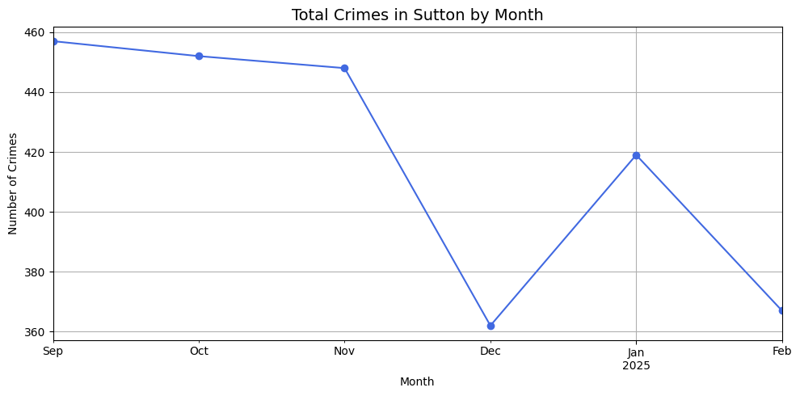
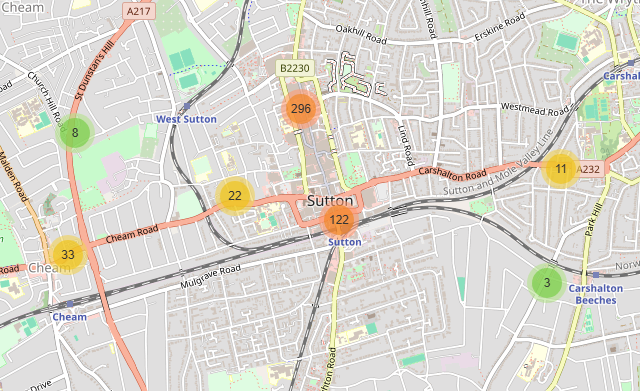
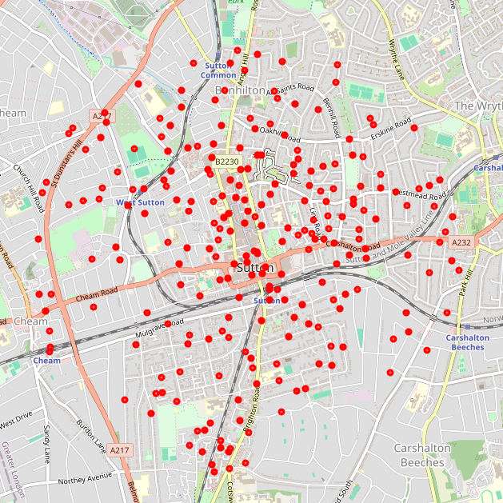
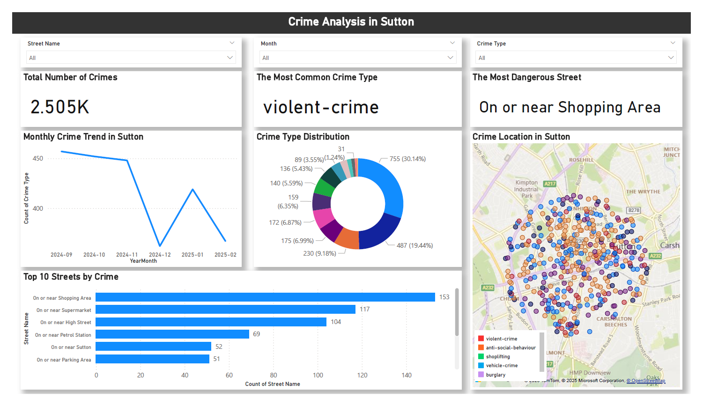

# 🕵️‍♂️ Crime Analysis in Sutton using UK Police Data API

## 📌 Overview
This project analyzes street-level crime data in Sutton, London using the UK Police Data API.  
It includes data collection, trend analysis, and geospatial visualization to identify key crime patterns and high-risk areas.

## 🧰 Tech Stack
- Python (pandas, matplotlib, seaborn, folium)
- Jupyter Notebook (VS Code)
- UK Police Data API ([https://data.police.uk/docs/](https://data.police.uk/docs/))

## 📂 Project Structure
```sutton-crime-analysis/ ├── data/ # Collected crime data (CSV) ├── notebooks/
│ └── 01_fetch_data.ipynb # Data fetching & preprocessing │ └── 02_eda_visualization.ipynb# Crime trend analysis │ └── 03_mapping_top5_streets.ipynb # Geospatial visualization ├── maps/ # HTML map outputs ├── images/ # Saved visualizations ├── README.md
```

## 🔍 What I Did
- Collected recent 5 months of crime data in Sutton using the UK Police API
- Cleaned and structured location data (latitude, longitude, street names)
- Visualized crime type distribution and monthly trends
- Identified the top 5 most dangerous streets in Sutton
- Built interactive maps showing crime locations

## 📊 Key Insights

- **Violent crime** showed a sharp drop in January, likely due to reduced social activity during the post-holiday period, followed by a rebound in February.
- **Shoplifting, vehicle crime, and burglary** all surged in January, suggesting a potential link to post-holiday economic stress or seasonal shopping patterns.
- **Anti-social behaviour** remained consistently high across all months, indicating ongoing issues with public disturbances in residential areas.
- **The majority of crimes were concentrated in a small number of streets**, suggesting that police patrols and community interventions can be more effective if geographically focused.


## 🗺️ Example Visualizations







## 🚓 Data-Driven Patrol & Policy Recommendations

Based on the spatial and temporal patterns identified in the data, several strategies can be proposed to improve public safety in Sutton:

- **Targeted Patrol Zones:**  
  The top 10 streets with the highest number of violent crimes were identified. Concentrated police presence in these hotspots can serve as a deterrent and provide faster response times.

- **Shoplifting Mitigation:**  
  The spike in shoplifting incidents in January may be linked to post-holiday financial pressure. Retailers and local authorities could consider coordinated awareness campaigns or increased surveillance during this period.

- **Anti-Social Behaviour Monitoring:**  
  Since anti-social behaviour incidents remain persistently high, especially in residential areas, community outreach programs, neighborhood watch systems, and environmental design (e.g., better lighting) should be considered.

- **Seasonal Resource Allocation:**  
  Law enforcement and community safety efforts can be planned seasonally, with heightened attention in high-risk months like January and February, based on crime type trends.

These recommendations are made based on real location-based crime data and can be used by public safety stakeholders to make informed decisions.

## 📈 PowerBI Dashboard



## 🚀 How to Run
1. Clone this repo
2. Run the notebooks in order: 01 → 02 → 03
3. Explore the results or customize for your own area
