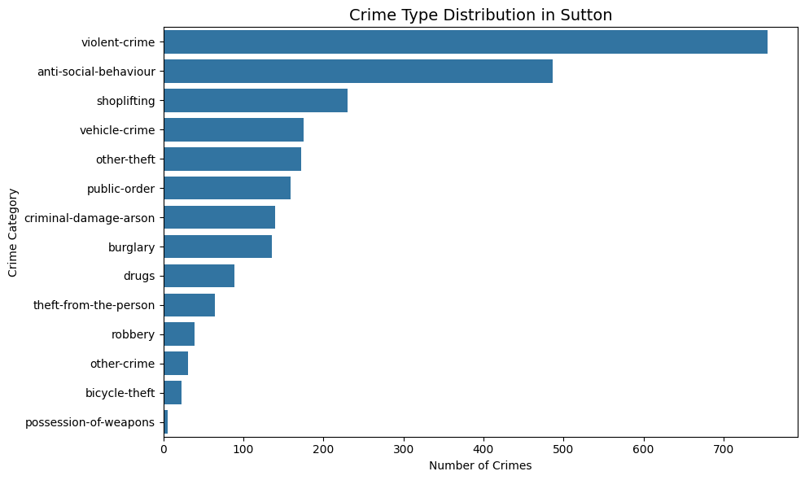
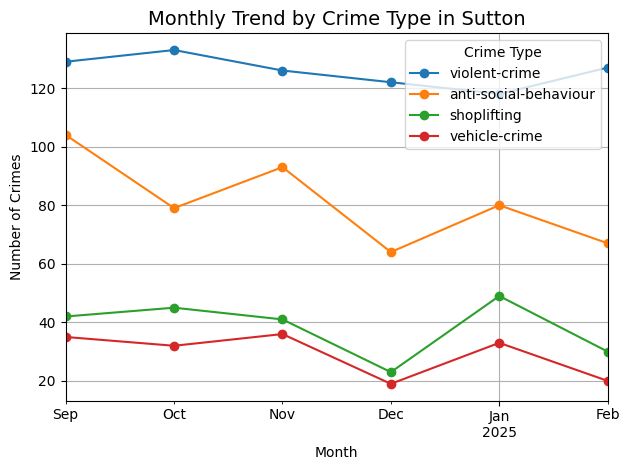

# 🕵️‍♂️ Crime Analysis in Sutton using UK Police Data API

## 📌 Overview
This project analyzes street-level crime data in Sutton, London using the UK Police Data API.  
It includes data collection, trend analysis, and geospatial visualization to identify key crime patterns and high-risk areas.

## 🧰 Tech Stack
- Python (pandas, matplotlib, seaborn, folium)
- Jupyter Notebook (VS Code)
- UK Police Data API ([https://data.police.uk/docs/](https://data.police.uk/docs/))

## 📂 Project Structure
```sutton-crime-analysis/ ├── data/ # Collected crime data (CSV) ├── notebooks/
│ └── 01_fetch_data.ipynb # Data fetching & preprocessing │ └── 02_eda_visualization.ipynb# Crime trend analysis │ └── 03_mapping_top5_streets.ipynb # Geospatial visualization ├── maps/ # HTML map outputs ├── images/ # Saved visualizations ├── README.md
```

## 🔍 What I Did
- Collected recent 5 months of crime data in Sutton using the UK Police API
- Cleaned and structured location data (latitude, longitude, street names)
- Visualized crime type distribution and monthly trends
- Identified the top 5 most dangerous streets in Sutton
- Built interactive maps showing crime locations

## 📊 Key Insights
- Violent crimes dropped sharply in January, then rose again in February
- Most other crimes (e.g., shoplifting, vehicle crime) peaked in January, possibly due to post-holiday economic stress
- Anti-social behaviour was consistently high across months
- The top 5 crime-prone streets were visualized using Folium maps

## 🗺️ Example Visualizations


- [Interactive Map: Violent Crimes in Sutton](maps/violent_crimes_sutton_map.html)
- [Top 5 Streets Map](maps/top5_crime_streets_map.html)

## 🚀 How to Run
1. Clone this repo
2. Run the notebooks in order: 01 → 02 → 03
3. Explore the results or customize for your own area
